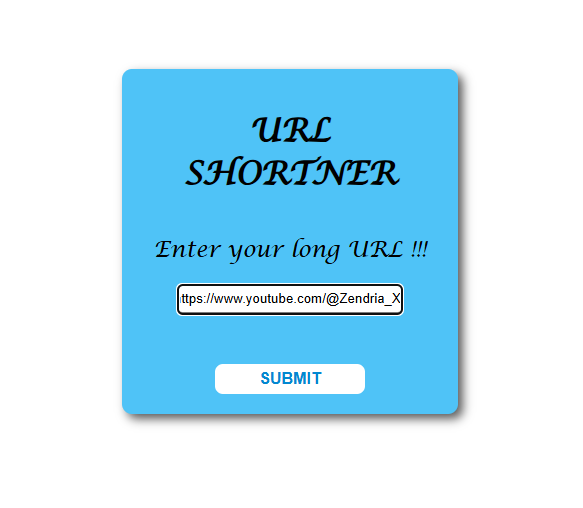
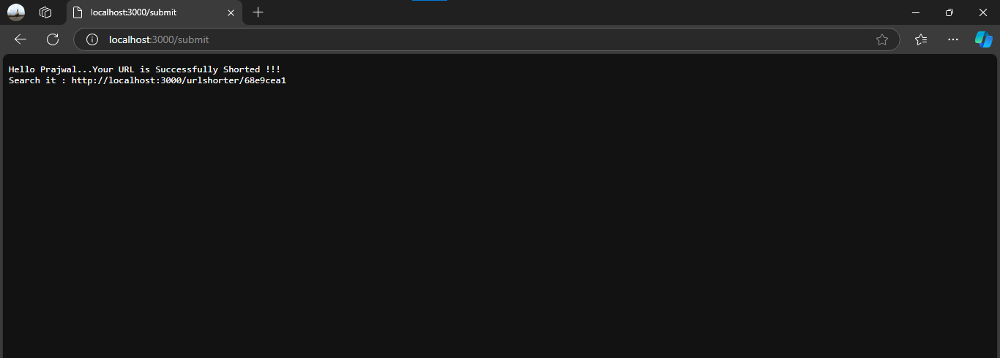

# URL_Shortner_With_Go

This project is a URL shortner which converts the users long URL into short URL. If we search short URL which is converted by Go server it will shows the result of orignal URL. The behaviour of URL is same but differ in length of URL.

## Project Structure

- **index.html**: The landing page where users can input the long URL to short it.

- **main.go**: The backend Go server use `crypto/md5` & `encoding/hex` packages for hashing & converting that long URL into short URL. When user search for converted short URL it will redirect(work like) to the orignal URL. 


## Getting Started

### Prerequisites

- [Go](https://golang.org/) installed on your machine.
- Basic understanding of Go and HTML.

### Installation

1. Clone the repository :
   ```bash
   git clone https://github.com/PJ9172/URL_Shortner_With_Go.git
   ```
2. Navigate to the project directory :
    ```bash
    cd URL_Shortner_With_Go
    ```
### Running The Project

1. Run the Go Server : 
    ```bash
    go run main.go
    ```
2. Open your browser and navigate to `http://localhost:3000/` to access the main page.

3. If your `port:3000` is busy then change it according to your availability. Change the code in `main.go` & run it again.
   ```go
   err := http.ListenAndServe(":your_available_port", nil)
   ```
### Screenshots

- Landing Page : 

   

- Shorted URL : 

   
